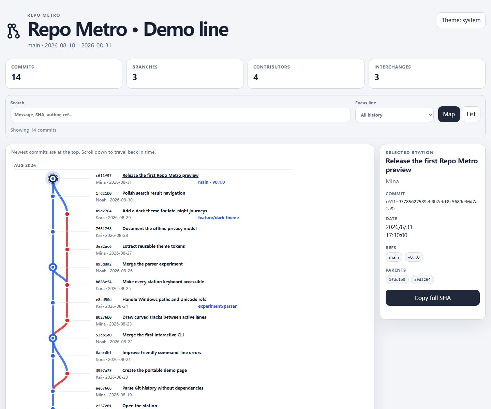

# Repo Metro

[简体中文](README.zh-CN.md)

> Turn Git history into an explorable metro map—branches become lines, commits become stations, and merges become interchanges.



Repo Metro is a zero-runtime-dependency Node.js CLI that reads a local Git repository and produces one portable, interactive HTML file. The generated map works offline and makes no network requests.

## Why Repo Metro?

Traditional Git graphs are precise, but they can be hard to scan or share. Repo Metro turns the same topology into a visual snapshot that is useful for onboarding, release retrospectives, project archaeology, and simply seeing how a repository grew.

| Git concept | Metro metaphor |
| --- | --- |
| Topological path | Line |
| Commit | Station |
| Merge commit | Interchange |
| Branch or tag ref | Station label |
| HEAD | Current stop |

> A colored track represents a path through the commit topology. It is not a permanent claim that every commit belongs to a single named Git branch.

## Features

- Draw commits, parents, merges, branches, remote refs, and tags as a vertical metro map.
- Search by message, SHA, author display name, branch, or tag.
- Focus a local branch without removing the surrounding merge context.
- Inspect commits, jump to parents, and copy full SHAs.
- Switch between the visual map and an accessible commit list.
- Use the keyboard: `/` searches, `J/K` or arrow keys move between stations, and Enter selects.
- Follow the system theme or switch between light and dark modes.
- Generate a self-contained HTML file with no CDN, server, account, or API key.
- Keep analysis local. Email addresses are never included in the output.
- Run with zero runtime dependencies on Node.js 20 or newer.

## Quick start

Requirements: Node.js 20+, npm, and Git available on `PATH`.

```bash
git clone https://github.com/sysu19351015/repo-metro.git
cd repo-metro
npm install
npm run build
node dist/src/cli.js ../your-project --output repo-metro.html
```

Open `repo-metro.html` in any modern browser. Until the package is published to npm, the built CLI above is the supported local workflow.

## CLI reference

```text
repo-metro [repository] [options]

Arguments:
  repository                 Git repository to inspect (default: current directory)

Options:
  -o, --output <file>         Output HTML file (default: repo-metro.html)
  -n, --max-commits <count>  Include 10-5000 commits (default: 500)
      --title <text>          Override the map title
      --theme <mode>          auto, light, or dark (default: auto)
      --privacy <mode>        standard or strict (default: standard)
  -h, --help                  Show help
  -v, --version               Show the version
```

Examples:

```bash
# Map the current repository
node dist/src/cli.js .

# Map another repository and choose the output file
node dist/src/cli.js ../project -o artifacts/project-metro.html

# Alias all authors before sharing the file
node dist/src/cli.js ../project --privacy strict --theme dark
```

## Demo

Run:

```bash
npm run demo
```

Then open [`docs/index.html`](docs/index.html). The file is also ready to be served from the repository's `docs/` directory with GitHub Pages.

## Privacy and generated data

Repo Metro never uploads repository data. The generated HTML may still contain commit subjects, author display names, SHAs, branch names, and tags, so review it before publishing.

- `--privacy standard` includes author display names and omits email addresses.
- `--privacy strict` replaces author names with deterministic aliases such as `Contributor 1`.
- Repository file contents and diffs are never read or embedded.

Commit text and refs are treated as untrusted input. HTML markup is escaped and embedded JSON is encoded to prevent script injection.

## How it works

```text
git log / for-each-ref
        ↓
normalized commit graph
        ↓
deterministic active-lane layout
        ↓
inline SVG + CSS + small browser script
        ↓
one offline HTML file
```

Git supplies commits in child-before-parent topological order. Repo Metro maintains a unique set of active parent lanes, reuses shared ancestors, and draws cubic connections between positioned stations. The renderer then embeds the geometry and sanitized metadata into a single document.

## Limits

- The default snapshot contains the newest 500 commits; use `--max-commits` for a larger map.
- Histories beyond the selected limit are shown as continuing lines, not false root commits.
- Very large snapshots create large HTML and SVG documents; 5,000 commits is the current hard limit.
- Layout follows Git topology, not historical branch membership after branches are deleted or rewritten.
- The first version does not render diffs, file changes, or commit bodies.

## Development

```bash
npm install
npm test
npm run demo
npm pack --dry-run
```

The test suite covers argument validation, Git parsing, real merge/tag repositories, shared ancestors, octopus merges, truncated histories, deterministic layout, privacy, and HTML injection safety.

## Roadmap

- [x] v0.1 — Parse local history and render commits, merges, branches, and tags.
- [x] v0.1 — Generate a self-contained interactive HTML file.
- [x] v0.1 — Add search, branch focus, keyboard navigation, themes, and strict privacy.
- [ ] v0.2 — Improve layout and performance for histories with thousands of commits.
- [ ] v0.2 — Export the current view as SVG or PNG.
- [ ] v0.3 — Add release-to-release comparison and timeline playback.
- [ ] v1.0 — Stabilize CLI/config formats and publish reproducible benchmarks.

## Contributing

Issues and pull requests are welcome. See [CONTRIBUTING.md](CONTRIBUTING.md) for the local workflow and design constraints.

## Security

Please report vulnerabilities privately as described in [SECURITY.md](SECURITY.md).

## License

[MIT](LICENSE)
