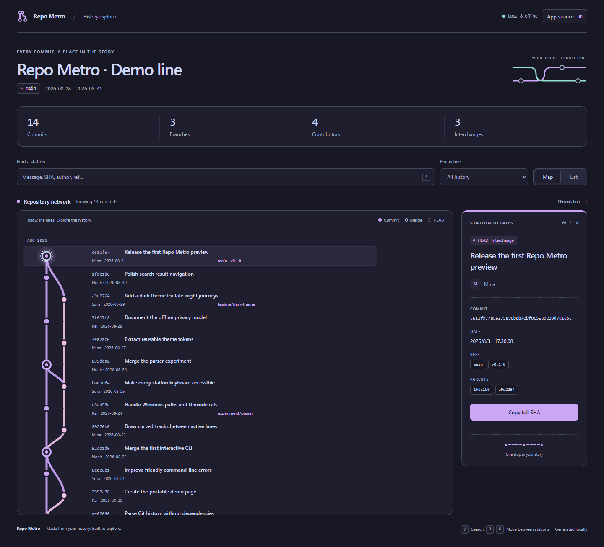

# Repo Metro

[English](README.md)

> 把 Git 历史变成可探索的地铁图：拓扑路径是线路、提交是站点、合并是换乘站。


Repo Metro 是一个运行时零依赖的 Node.js CLI。它读取本地 Git 仓库，并生成一个可离线打开、可交互、可直接分享的单文件 HTML；生成结果不会发起任何网络请求。

## 为什么选择 Repo Metro？

传统 Git 图很精确，但不一定容易浏览或分享。Repo Metro 将同一份拓扑转换成更直观的快照，适合新人熟悉项目、版本复盘、代码考古，也适合单纯看看一个仓库是怎样成长起来的。

| Git 概念 | 地铁隐喻 |
| --- | --- |
| 拓扑路径 | 线路 |
| Commit | 站点 |
| Merge commit | 换乘站 |
| 分支或标签 ref | 站点标签 |
| HEAD | 当前站 |

> 彩色轨道表示提交拓扑中的一条路径，不表示某个提交永久、唯一地属于某个命名分支。

## 功能

- 将提交、父子关系、合并、分支、远程 ref 和标签绘制成纵向地铁图。
- 按提交信息、SHA、作者显示名、分支或标签搜索。
- 聚焦本地分支，同时保留周围的合并上下文。
- 查看提交详情、跳转到父提交并复制完整 SHA。
- 在可视化地图与无障碍提交列表之间切换。
- 支持键盘：`/` 搜索，`J/K` 或方向键切换站点，Enter 选中。
- 跟随系统主题，或手动切换浅色和深色模式。
- 内置 Studio、Paper 和 Dusk 三套皮肤，每套均有完整的明暗配色。
- 生成不依赖 CDN、服务器、账户或 API Key 的单文件 HTML。
- 全程本地分析；输出中永远不会包含邮箱地址。
- Node.js 20+ 运行时零依赖。

## 快速开始

需要 Node.js 20+、npm，并确保 Git 已加入 `PATH`。

```bash
git clone https://github.com/sysu19351015/repo-metro.git
cd repo-metro
npm install
npm run build
node dist/src/cli.js ../你的项目 --output repo-metro.html
```

使用现代浏览器打开 `repo-metro.html` 即可。在 npm 包正式发布前，以上本地构建方式是当前支持的工作流。

## 切换外观

打开生成页面右上角的 **Appearance**：

- **Studio**：清爽的中性色界面，搭配靛蓝轨道。
- **Paper**：温暖纸色、森林绿轨道与衬线标题。
- **Dusk**：受 Catppuccin 启发的柔和紫色与粉彩轨道。

选择皮肤后，点击 **Theme** 在跟随系统、浅色和深色之间循环切换。浏览器允许本地存储时会记住这两项偏好；切换外观会保留当前提交、搜索词及分支焦点，全程无需联网。

手机上提交标签会分行显示；可在地图内横向滑动查看较长的历史，也可切换 **List** 列表。点击站点或提交标题，即可查看车票式详情卡。



设计参考和浏览器验证方式见 [外观说明](docs/appearance.md)。

## 命令行参数

```text
repo-metro [仓库路径] [选项]

参数：
  仓库路径                    要分析的 Git 仓库，默认为当前目录

选项：
  -o, --output <文件>         输出 HTML，默认为 repo-metro.html
  -n, --max-commits <数量>    包含 10-5000 个提交，默认为 500
      --title <文本>          自定义地图标题
      --theme <模式>          auto、light 或 dark，默认为 auto
      --privacy <模式>        standard 或 strict，默认为 standard
  -h, --help                  显示帮助
  -v, --version               显示版本
```

示例：

```bash
# 绘制当前仓库
node dist/src/cli.js .

# 绘制另一个仓库并指定输出文件
node dist/src/cli.js ../project -o artifacts/project-metro.html

# 分享前把作者名全部替换为匿名别名
node dist/src/cli.js ../project --privacy strict --theme dark
```

## 示例

运行：

```bash
npm run demo
```

然后打开 [`docs/index.html`](docs/index.html)。`docs/` 目录也已经可以直接启用 GitHub Pages。

## 隐私与生成数据

Repo Metro 不会上传仓库数据。不过，生成的 HTML 仍可能包含提交标题、作者显示名、SHA、分支名和标签，公开前请自行检查。

- `--privacy standard`：保留作者显示名，但不包含邮箱。
- `--privacy strict`：将作者替换为 `Contributor 1` 这样的稳定别名。
- 不读取或嵌入仓库文件内容与 diff。

提交文本和 ref 均按不可信输入处理。HTML 会被转义，内嵌 JSON 也会编码，避免脚本注入。

## 工作原理

```text
git log / for-each-ref
        ↓
标准化提交图
        ↓
确定性的活动车道布局
        ↓
内联 SVG + CSS + 少量浏览器脚本
        ↓
一个离线 HTML 文件
```

Git 按“子提交先于父提交”的拓扑顺序提供历史。Repo Metro 维护唯一的活动父提交车道，复用共享祖先，并在站点之间绘制曲线；渲染器再把几何信息和清理后的元数据写进一个文档。

## 当前限制

- 默认只包含最新 500 个提交，可通过 `--max-commits` 调整。
- 超出快照范围的历史会显示为继续向下的线路，不会伪装成根提交。
- 超大快照会生成较大的 HTML 和 SVG；当前硬上限为 5,000 个提交。
- 布局反映 Git 拓扑，无法恢复已删除或改写分支的完整历史归属。
- 首版不展示 diff、文件变化或完整 commit body。

## 本地开发

```bash
npm install
npm test
npm run demo
npm pack --dry-run
```

测试覆盖参数校验、Git 解析、真实 merge/tag 仓库、共享祖先、octopus merge、截断历史、确定性布局、隐私与 HTML 注入防护。

## 路线图

- [x] v0.1 — 解析本地历史并绘制提交、合并、分支和标签。
- [x] v0.1 — 生成完整的交互式单文件 HTML。
- [x] v0.1 — 加入搜索、分支聚焦、键盘导航、主题与严格隐私模式。
- [ ] v0.2 — 改进数千提交规模下的布局和性能。
- [ ] v0.2 — 导出当前视图为 SVG 或 PNG。
- [ ] v0.3 — 加入版本区间比较与时间轴回放。
- [ ] v1.0 — 稳定 CLI/配置格式并发布可复现性能基准。

## 参与贡献

欢迎提交 Issue 和 Pull Request。本地开发流程与设计约束见 [CONTRIBUTING.md](CONTRIBUTING.md)。

## 安全

请按照 [SECURITY.md](SECURITY.md) 中的方式私下报告安全问题。

## 许可证

[MIT](LICENSE)
